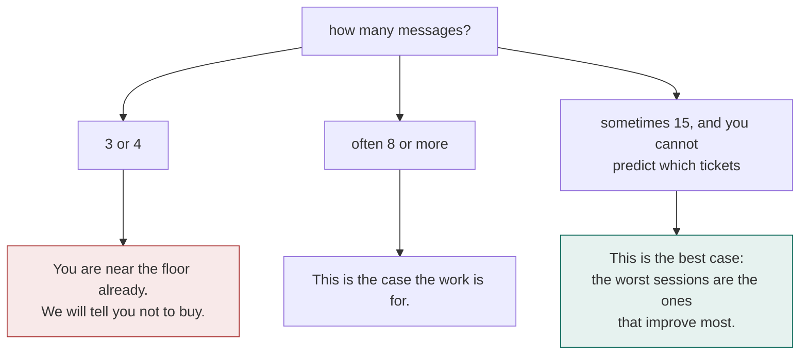
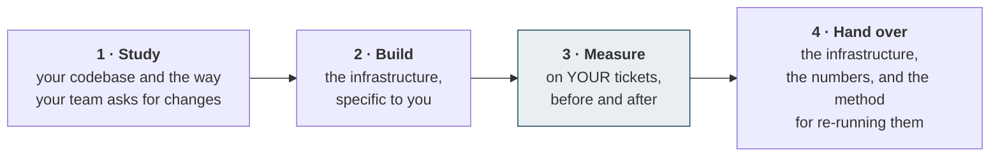
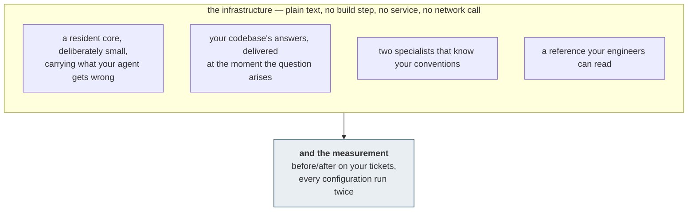

# Working with us

## Is your codebase a candidate

One question answers it, and it takes two minutes.

> Open the last three sessions where you asked your agent to find or fix something. Count the
> messages between your request and the moment it opened the file it actually changed.

The gain tracks the size and the internal ambiguity of a codebase, not its language. Across the
five measured here it ran from 52% of tokens on a nine-thousand-file monorepo down to 12% on an
eighty-three-file project — where the honest advice is to keep your money.

## How an engagement runs

**Step 3 is the one that distinguishes this from a consulting deliverable nobody checks.** The
measurement is part of the work, it runs on your own tickets, and you receive the result whatever
it says. If the number is poor, you will hear it from us.

## What you receive

It installs by copying files into a checkout. It adds; it rewrites nothing and removes nothing.
Deleting those files removes it completely.

## What we need from you

| | |
|---|---|
| Read access to the codebase | for the duration of the study |
| Twenty to fifty closed tickets | with the commits that resolved them — this is what the measurement runs on |
| One engineer, a few hours | to confirm what is genuinely confusing, and what only looks it |
| Your agent platform | the work targets the tool your team already uses |

The closed tickets matter more than they sound. They are how the measurement uses *your* work
rather than a benchmark of ours, and they are what makes the resulting number yours to quote
internally.

## What we will not claim

**That your agent will be more often right.** Measured across 336 sessions, correctness does not
move outside the noise. The work makes an agent faster, cheaper and far more predictable. It does
not make it cleverer, and anyone selling you that has not measured it.

**That every codebase benefits.** Below roughly five hundred source files the gain collapses. We
publish the case where it did — jq, 12% — rather than leaving it out of the table.

## Getting started

A first conversation needs nothing but the two-minute count above. If the numbers say your team
is already near the floor, that conversation ends there and costs you nothing.

Contact details are with the case studies in this repository's front page.
