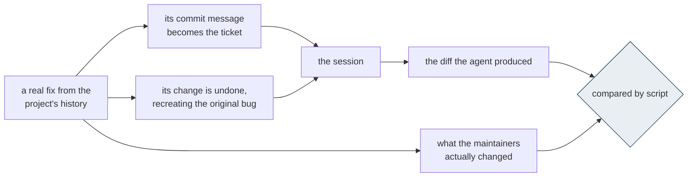
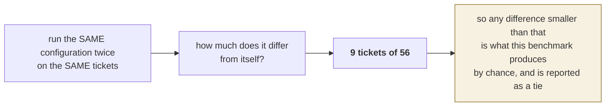
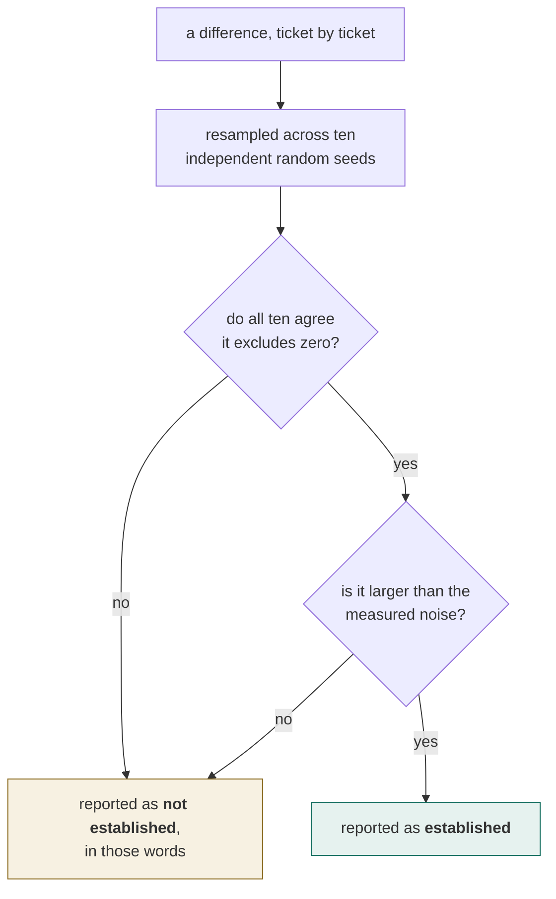

# Why these numbers can be believed

Anyone can publish a percentage. What follows is the reason to trust this one, and it is the part
of the work that most resembles what an engagement actually buys: not a file of rules, but a
measurement you can act on.

## The comparison

An agent receives a real ticket from a project's own history and must produce the fix. It holds
the editing tools. The diff it writes is compared, by script, to the one the maintainers actually
wrote.

Three properties follow, and none of them is available to a benchmark whose cases are written by
the vendor:

- **we did not write the ticket.** It is what a maintainer wrote, with its real vagueness and its
  issue number;
- **we did not write the answer either.** It is where the maintainers actually changed the code;
- **the bug is real.** It shipped, someone hit it, someone fixed it.

No model judges anything. The cases are fixed on disk before any session runs.

## The benchmark measures its own noise first

This is the step almost nobody publishes, and it is what makes the rest readable.

Every configuration runs twice, and the order alternates so that the drift in model latency over
a long run lands on all of them equally rather than on whichever went last.

## When a difference is claimed

The ten seeds are not decoration. An earlier round produced a result that held for one seed and
not the others, and was within a day of being published.

## What was declared unwinnable before the data existed

Five of the fifty-six tickets point at a place the real fix does not touch — the clearest asks
for line endings to be normalised in two modules, while the actual change touched a single
configuration file. Such a ticket is a forced zero for every configuration; it cannot carry a
difference, it only dilutes the others.

The list was fixed **before the round was read**, by a rule that looks only at a previous round
and the shape of the original commit. Both readings are published: the headline covers all 56
tickets, the 51 winnable ones are shown beside it, and the difference between them is under half
a percentage point.

Choosing the flattering subset after seeing the result is the oldest way to mislead with real
data. The protection is that the list existed first.

## Fidelity, checked on every row

A measurement of a product that did not install is worse than no measurement.

| Checked, never assumed | Result |
|---|---|
| tickets complete and error-free in all six runs | 56 of 56 |
| sessions carrying the full infrastructure | 112 of 112 |
| distinct ticket texts across all 336 sessions | **1** |
| sessions given any extra capability | 0 |
| diffs re-scored from disk, agreeing with their record | 330 of 330 |

Every diff an agent produced is kept, so any score can be recomputed without re-running anything.

## What the round cost, including what was thrown away

336 sessions, zero errors, **$151.65**. A further **$41.54** of measurement was discarded after
faults were found in the instrument while the round was running — among them a scorer that
recorded "changed nothing" for sessions which had correctly edited the right file.

Both figures are here because the second is the reason to trust the first. An outfit that never
throws a measurement away has never checked one.

## What this round does not cover

The trees carry no installed dependencies, so the projects cannot be built and their test suites
cannot be run — and both configurations were told so in identical words, recorded in every
result. What is measured is therefore locating and editing. Build and test knowledge, which is a
real part of what an engagement delivers, is measured separately on a benchmark graded by running
the suite.
