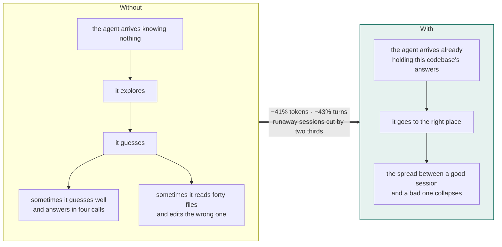
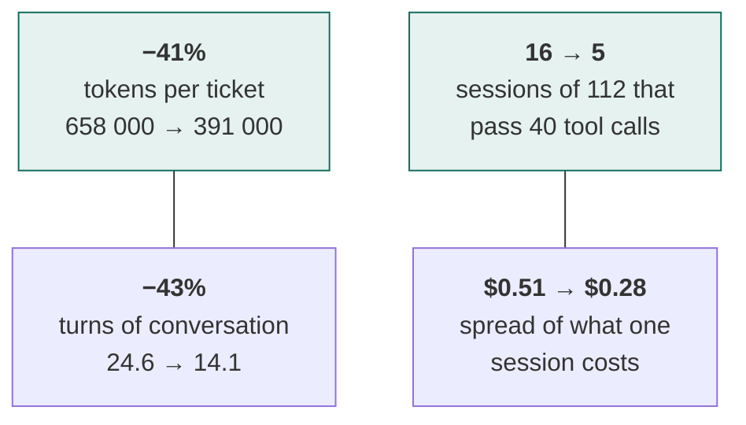
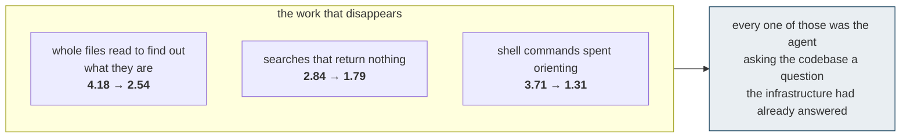

# What the infrastructure does

A large codebase carries knowledge that is nowhere in the code: which of two identically named
classes is the live one, which directory is frozen, which change has to be made in two places or
it silently does nothing. A human learns it over months. An agent re-derives it from scratch
every session, and how long that takes is a lottery.

The infrastructure ends the lottery.

## What an agent gets that it did not have

**The vocabulary your codebase actually uses.** Every mature system has a gap between the words
on the screen and the words in the source. What Keycloak's interface calls an *identity provider*
its engine calls a `broker`; what its admin screens call *user federation* the code calls
`storage`. An agent that searches the words a human would use finds the administrative surface
and never the machinery. Closing that gap is the single highest-yield thing an engagement does,
and it is entirely specific to one codebase.

**The traps, before they are sprung.** Four class names declared twice, where the first search
result is always the dead one. A directory that looks alive and was frozen two years ago. A
hundred JavaScript files that are build output, silently regenerated over any edit. A change that
must touch two files or it compiles and does nothing.

**The answer at the moment of the question.** When the agent is about to spend calls
rediscovering something this codebase has already taught us, it receives the answer instead. Not
a pointer to where the answer lives — the answer.

**Two specialists that know the house rules.** A reviewer that knows this project's conventions,
and one that answers what else a change touches. Available when wanted, costing nothing when not.

## What that buys, measured

Across 56 real defect tickets on five large codebases, 336 sessions, every configuration run
twice:

The averages are the smaller half. **The spread halves, and the sessions that run away mostly
stop happening** — one in seven becomes one in twenty-two. What a team buys is not a discount on
tokens. It is the disappearance of the afternoon where the agent read forty files and changed the
wrong one, and the ability to tell a product owner how long something will take.

## Where the gain comes from

Not from making the agent search less. From removing the ambiguity it would otherwise have to
resolve by searching.

## Where it does not help

**Correctness does not move.** Across the five codebases the infrastructure placed its fix
correctly on 42.5 tickets of 56 against 40.5 without — a difference inside what the benchmark
produces by chance. This is not a product that makes an agent smarter. It makes it faster,
cheaper and far more predictable at the thing it was already doing.

**Small codebases do not need it.** On an eighty-three-file C project the agent finds its own way
and the gain falls to 12%. Below roughly five hundred source files we will tell you not to buy.

That second sentence is in this document deliberately. A claim about where something works is
worth exactly as much as the willingness to name where it does not.
